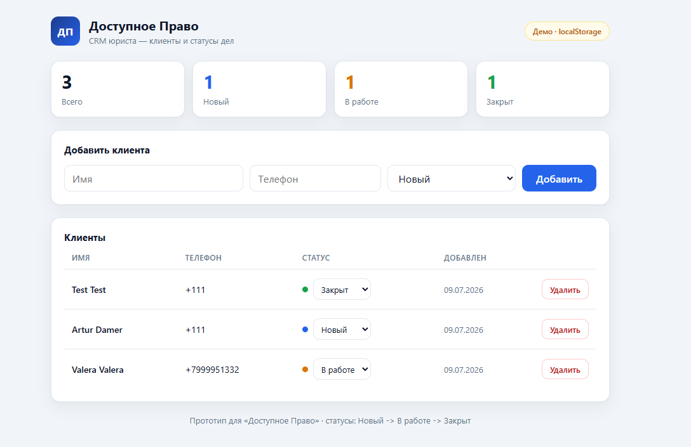
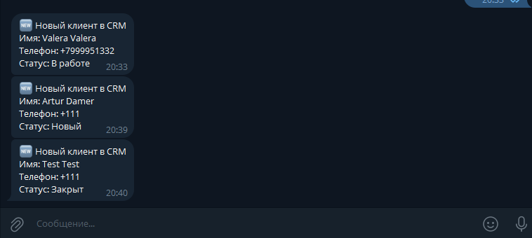

# CRM юриста — прототип для «Доступное Право»

Дашборд, где юрист ведёт своих клиентов: таблица клиентов, добавление, смена статуса
дела и счётчики по статусам. Бонус — Telegram-уведомление при добавлении клиента.

**Живая ссылка:** https://lawyer-crm-two.vercel.app

## Сценарий

1. Юрист открывает дашборд.
2. Видит таблицу клиентов и счётчики: Всего / Новый / В работе / Закрыт.
3. Добавляет клиента (имя, телефон, статус).
4. Меняет статус: Новый -> В работе -> Закрыт.
5. Счётчики обновляются мгновенно.

## Стек

- **React + Vite + TypeScript** — фронтенд.
- **Хранение данных** — `localStorage` в текущей живой версии; код поддерживает
  переключение на **Supabase (Postgres)** автоматически, если заданы env-ключи
  (CRUD через anon-ключ + RLS).
- **Vercel** — деплой фронтенда и serverless-функции.
- **Telegram Bot API** — уведомление юристу при добавлении клиента (`api/notify.js`).

Живой прототип развёрнут на `localStorage` (данные хранятся в браузере) — это
позволяет держать рабочую ссылку без внешних сервисов. Для общей БД между
устройствами достаточно задать ключи Supabase (см. ниже), код подхватит её без правок.

## Демонстрация уведомления

При добавлении клиента:
1. В интерфейсе появляется подтверждение: «✓ Клиент добавлен · уведомление
   отправлено юристу в Telegram».
2. Юристу в Telegram приходит карточка нового клиента (имя, телефон, статус).

Дашборд:



Уведомления в Telegram при добавлении клиентов:



> Уведомление уходит в Telegram владельца бота, поэтому доказательство приложено
> скриншотом.

## Локальный запуск

```bash
npm install
cp .env.example .env   # заполнить при использовании Supabase (необязательно)
npm run dev
```

## Настройка Supabase (опционально)

1. Создать проект на https://supabase.com.
2. SQL Editor -> выполнить `supabase.sql`.
3. Project Settings -> API: скопировать `Project URL` и `anon public` key в `.env`
   (`VITE_SUPABASE_URL`, `VITE_SUPABASE_ANON_KEY`).

## Деплой на Vercel

1. Импортировать репозиторий в Vercel (framework определится как Vite автоматически).
2. Environment Variables:
   - `VITE_SUPABASE_URL`, `VITE_SUPABASE_ANON_KEY` — из Supabase.
   - `TELEGRAM_BOT_TOKEN`, `TELEGRAM_CHAT_ID` — для уведомлений (только на сервере).
3. Deploy.

## Лог работы

- **Что делал AI (Claude Code):** сгенерировал каркас Vite+React, слой данных с
  переключением Supabase/localStorage, UI дашборда, serverless-функцию для Telegram,
  SQL-схему и этот README.
- **Что делал сам:** выбрал стек и архитектуру, задал сценарий и модель данных,
  решение с localStorage-фоллбэком (гарантия рабочей демо-ссылки), проверил сборку
  и работу в браузере, настроил деплой и переменные окружения.
- **Почему такой стек:** React + Vercel — самый быстрый путь к рабочему MVP с
  бесплатным деплоем; хранилище абстрагировано, поэтому переход с localStorage на
  Supabase не требует правок UI; serverless-функция закрывает бонус по автоматизации,
  не раскрывая токен бота на клиенте.
